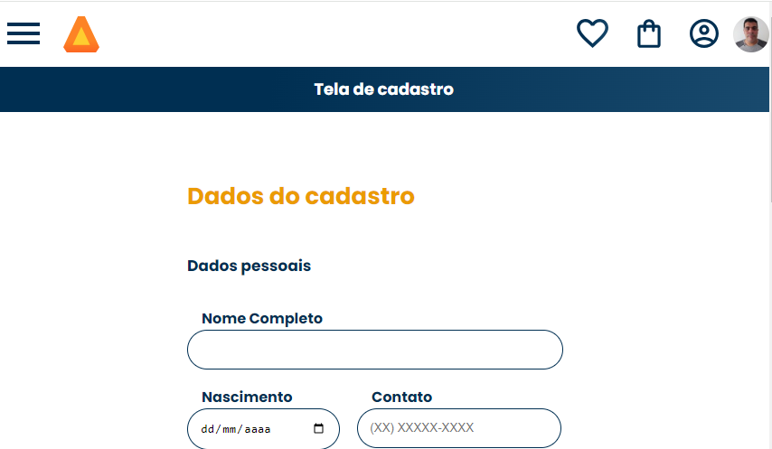
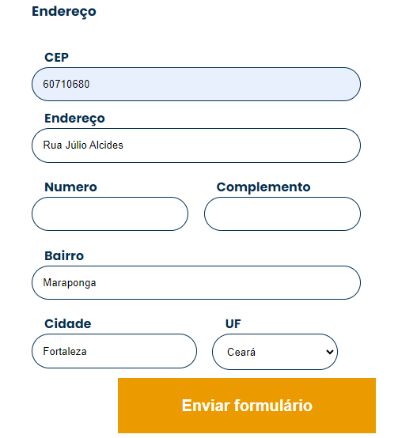

# js-consumindo-dados-api
Repositório do treinamento "JavaScript: Consumindo e tratando dados de uma API" da Alura Cursos Online.

# Utilização da API 
  Repositório utilizando a API da viacep, assim o cliente informar o CEP e o sistema completa os dados disponíveis.

# Fotos página:

## Dados pessoais

## Endereço

